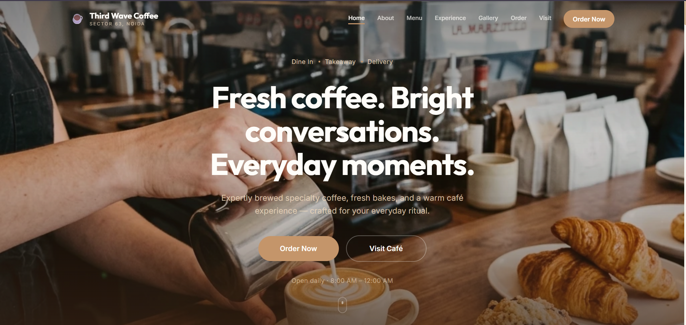

# ☕ Third Wave Coffee

A modern, responsive café website built with **Next.js** and **Tailwind CSS** for **Third Wave Coffee, Sector 63, Noida**. The website delivers a clean browsing experience with menu highlights, café information, gallery, and multiple ordering options.

## 🌐 Live Demo

https://make-my-day-website.vercel.app/

---

## 📸 Preview



---

## ✨ Features

- Modern and responsive UI
- Interactive menu with categorized items
- Café gallery and experience section
- Delivery, takeaway, and call ordering options
- Smooth navigation across all sections
- Mobile-friendly design

---

## 🛠 Tech Stack

- Next.js
- React
- Tailwind CSS
- JavaScript
- Vercel

---

## 🚀 Getting Started

Clone the repository

```bash
git clone https://github.com/gitkrishna18/Third--Wave-Coffee.git
```

Install dependencies

```bash
npm install
```

Run the development server

```bash
npm run dev
```

Open:

```
http://localhost:3000
```

---

## 📂 Project Structure

```
Third--Wave-Coffee
├── assets
├── public
├── src
├── package.json
└── README.md
```

---

## 📌 Project Highlights

- Built as a frontend café website
- Responsive across desktop and mobile devices
- Clean UI focused on user experience
- Deployed on Vercel

---

## 📄 License

This project is for learning and portfolio purposes.
